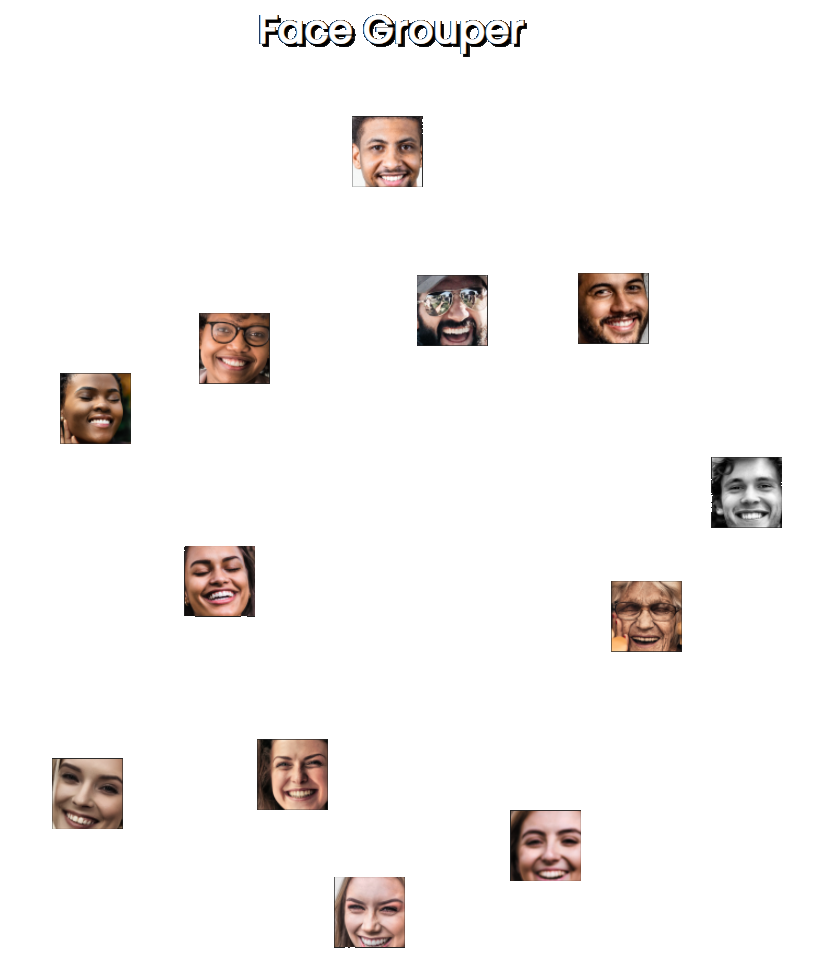

# Dependencies
* flask
* face_recognition
* opencv-python
* pickle
* numpy

Install dependencies via pip:
```pip3 install -r requirements.txt```

## Installation
Just clone the repository, install the dependencies and put your images in the images-folder. Next run the ```main.py``` and wait until it says "Running on http://127.0.0.1:8080...". Then go to [your local web-app](http://127.0.0.1:8080) and checkout your face-group. You can even play with it using drag-and-drop.
In the screenshot above I used some images from [pexel.com](https://www.pexels.com/).

